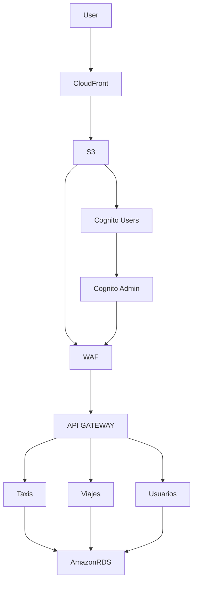

# Gestión de Taxis

Comandos:
To run this project

`terraform init`

`terraform apply`

`terraform plan`

```mermaid
graph TD
    A[User] ---> B[CloudFront]
    B[CloudFront] ---> C[S3]
    C[S3] --->  E[WAF]
    C[S3] --->  D[Cognito Users]
    D[Cognito Users] ---> G[Cognito Admin]
    G[Cognito Admin] ---> E[WAF]
    E[WAF] --->F[API GATEWAY]
    F[API GATEWAY] ---> H[Taxis]
    F[API GATEWAY] ---> I[Viajes]
    F[API GATEWAY] ---> J[Usuarios]
    H[Taxis] ---> K[AmazonRDS]
    I[Viajes] ---> K[AmazonRDS]
    J[Usuarios] ---> K[AmazonRDS]
```