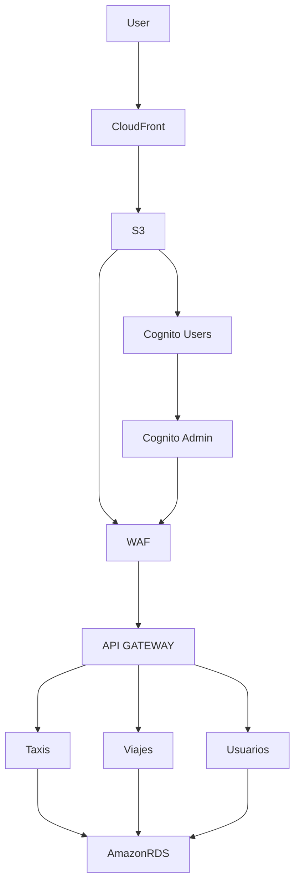

# Proyecto Infraestructura para la Gestión de Taxis

# Problematica
Juan Carlos administra una flota de aproximadamente 30 taxis. Hasta ahora ha gestionado manualmente a sus trabajadores, lo que resulta ineficiente y poco escalable. Desea mejorar la seguridad para los clientes y expandir su negocio mediante una aplicación moderna en la nube que permita a los usuarios solicitar taxis de manera confiable y segura. El producto debe ser escalable y fácil de mantener.

# Objetivos del Proyecto
Desarrollar una solución en la nube para gestionar de forma eficiente una flota de taxis mediante una aplicación web escalable, que permita a los usuarios solicitar servicios de transporte, mejorar la seguridad y automatizar el control de operaciones, utilizando servicios serverless en AWS.

* Objetivos Específicos

* Diseñar una arquitectura serverless en AWS que asegure escalabilidad, bajo costo y alta disponibilidad del sistema.
* Implementar una aplicación web que permita a los usuarios registrarse, iniciar sesión y solicitar taxis mediante un flujo seguro y eficiente.
* Utilizar herramientas de infraestructura como código (IaC) como Terraform para desplegar automáticamente los recursos necesarios.
* Desarrollar funciones Lambda desacopladas para gestionar la lógica de usuarios, taxis y viajes.
* Integrar un sistema de autenticación y autorización con AWS Cognito, diferenciando usuarios y administradores.
* Almacenar y consultar información en una base de datos relacional (Amazon RDS) para mantener persistencia de datos.
* Aplicar buenas prácticas de seguridad mediante el uso de WAF y control de acceso IAM para los recursos.
* Documentar y versionar el proyecto en un repositorio Git con estructura clara y archivos descriptivos.

Comandos:
Para ejecutar el proyecto

`terraform init`

`terraform plan`

`terraform apply`

# IMPORTANTE
- Si se quiere comprobar el cognito: crear un user
- Cambiar la URL del api en el index
- Instalar los node_modules del pgadmin mediante `npm install pg`
- Subir el index al bucket para que el cloudfront funcione

